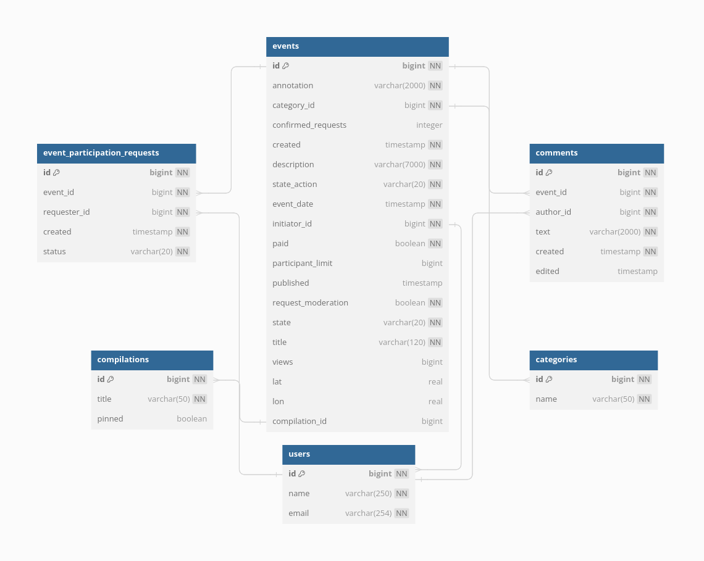
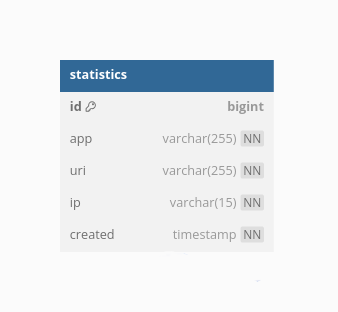

# Explore With Me
Свободное время — ценный ресурс. Ежедневно мы планируем, как его потратить — куда и с кем сходить. Сложнее всего в таком планировании поиск информации и переговоры. Нужно учесть много деталей: какие намечаются мероприятия, свободны ли в этот момент друзья, как всех пригласить и где собраться.
Приложение "Explore With Me" — афиша. В этой афише можно предложить какое-либо событие от выставки до похода в кино и собрать компанию для участия в нём.
## Реализация
Фунционал приложения разделён на два сервиса:
* основной сервис содержит всё необходимое для работы продукта;
* сервис статистики хранит количество просмотров и позволяет делать различные выборки для анализа работы приложения.

### Основной сервис
Основной сервис состоит из:
* **публичной части**, которая доступна без регистрации любому пользователю сети; 
 *предоставляет возможности поиска и фильтрации событий*
* **закрытой части**, которая доступна только авторизованным пользователям;  
*позволяет добавлять в приложение новые мероприятия, редактировать их и просматривать после добавления, а также подавать заявки на участие в интересующих мероприятиях и подтверждать заявки, которые отправили другие пользователи сервиса*
* **административной части** — для администраторов сервиса.   
*позволяет добавлять, удалять и закреплять на главной странице подборки мероприятий, выполнять модерацию событий и упралять пользователями*

### Сервис статистики

Функционал сервиса статистики содержит:
* запись информации о том, что был обработан запрос к эндпоинту API;
* предоставление статистики за выбранные даты по выбранному эндпоинту.

## Спецификация API
Для обоих сервисов разработаны подробные спецификации API:
* спецификация основного сервиса: <a href="ewm-main-service-spec.json">ewm-main-service-spec.json</a>;
* спецификация сервиса статистики: <a href="ewm-stats-service.json">ewm-stats-service.json</a>.

## Стэк
* JDK Amazon Coretto version 11 - кроссплатформенный дистрибутив OpenJDK с долгосрочной поддержкой
* Spring Boot - модуль фреймворка Spring для создания приложений с использованием Java
* Maven - инструмент для автоматической сборки проектов на Java
* Lombok - основанная на аннотациях библиотека Java, позволяющая сократить шаблонный код
* JDBC - API для взаимодействия с базами данных
* PostgreSQL - мощная объектно-реляционная система баз данных с открытым исходным кодом

## ER диаграммы

*  для основного сервиса  

* для сервиса статистики  

## Описание коммитов
----------------------------------------------------------------------------------
| Название | Описание                                                            | 
|----------|---------------------------------------------------------------------|
| docs     | Обновление документации                                             |
| feat     | Добавление нового функционала                                       | 
| fix      | Исправление ошибок                                                  |
| refactor | Правки кода без исправления ошибок или добавления нового функционала|
| style    | Правки по codestyle (табы, отступы, точки, запятые и т.д.)          |
| test     | Добавление тестов                                                   |
----------------------------------------------------------------------------------